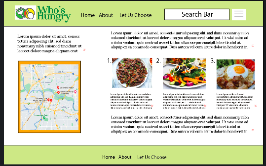

# Title: Who's Hungry?
Group 10: Rachel Kroetch, Uyen Nguyen, Tria Thao, Christopher Barnhart

# Project Description
An app that allows the user to search for restaurants when they want to try some place new.  The app will use the APIs of Zomato and google maps to provide information about the restaurants as well as directions to the place of their choice. 

# User Story
AS A food enthusiast
I WANT to find local restaurants based on ratings and cuisine type
SO THAT I can try new food in my area

# Acceptance Criteria
- when user opens the app, 
- then it shows stock image of food
- when user searches city and cuisine type, 
- then given top 5 results
- when user clicks a restaurant, 
- then given pictures of the food and map location
- when user clicks the map, 
- then given directions to the restaurant

# Image

# API's
Zomato & Google Maps

# Breakdown of Tasks
- front end design using new css framework
- get api keys
- use local storage to hold past searches
- use ajax to call information from the APIs
- display search results dynamically using JavaScript